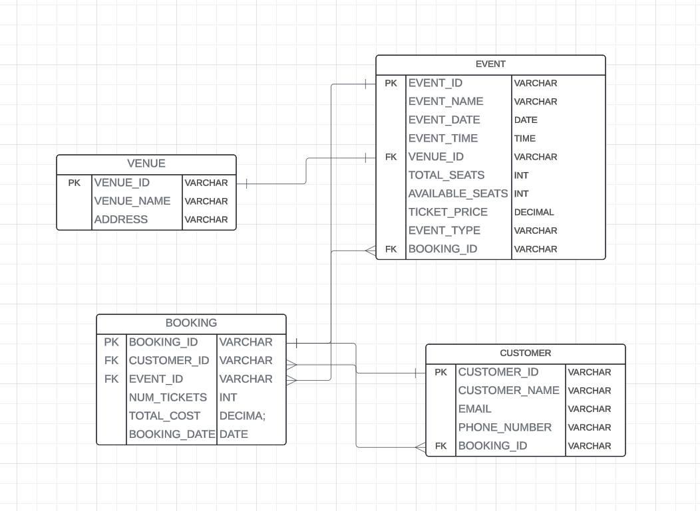

# TASK - 1

##  Database Design
1. Create the database named "TicketBookingSystem" - DONE 
2. Write SQL scripts to create the mentioned tables with appropriate data types, constraints, and relationships.  
- Venu  
- Event  
- Customers  
- Booking 
3. Create an ERD (Entity Relationship Diagram) for the database.  
4. Create appropriate Primary Key and Foreign Key constraints for referential integrity. 

### 2.Write SQL scripts to create the mentioned tables with appropriate data types, constraints, and relationships.  
- Venu  
- Event  
- Customers  
- Booking

```sql
CREATE TABLE [Venue] (
	[Venue_id] VARCHAR,
	[Venue_name] VARCHAR,
	[address] VARCHAR,
	PRIMARY KEY ([Venue_id]));


CREATE TABLE [EVENT] (
	[EVENT_ID] VARCHAR,
	[EVENT_NAME] VARCHAR,
	[EVENT_DATE] DATE,
	[EVENT_TIME] TIME,
	[VENUE_ID] VARCHAR,
	[TOTAL_SEATS] INT,
	[AVAILABLE_SEATS] INT,
	[TICKET_PRICE] DECIMAL,
	[EVENT_TYPE] VARCHAR,
	[BOOKING_ID] VARCHAR
	PRIMARY KEY ([EVENT_ID]),
	Foreign Key ([VENUE_ID]) references VENUE([VENUE_ID]),
	--Foreign Key ([BOOKING_ID]) references BOOKING([BOOKING_ID]),
);

CREATE TABLE [CUSTOMER] (
	[CUSTOMER_ID] VARCHAR,
	[CUSTOMER_NAME] VARCHAR,
	[EMAIL] VARCHAR,
	[PHONE_NUMBER] VARCHAR,
	[BOOKING_ID] VARCHAR,
	PRIMARY KEY ([CUSTOMER_ID]),
	--Foreign Key ([BOOKING_ID]) references BOOKING([BOOKING_ID]),
);


CREATE TABLE [BOOKING] (
	[BOOKING_ID] VARCHAR,
	[CUSTOMER_ID] VARCHAR,
	[EVENT_ID] VARCHAR,
	[NUM_TICKETS] INT,
	[TOTAL_COST] DECIMAL,
	[BOOKING_DATE] DATE
	PRIMARY KEY ([BOOKING_ID]),
	Foreign Key ([CUSTOMER_ID]) references CUSTOMER([CUSTOMER_ID]),
	Foreign Key ([EVENT_ID]) references EVENT([EVENT_ID]),
);
```

### 3.Create an ERD (Entity Relationship Diagram) for the database.  


### 4. Create appropriate Primary Key and Foreign Key constraints for referential integrity. 

```sql
ALTER TABLE EVENT
   ADD FOREIGN KEY (BOOKING_ID)
    REFERENCES BOOKING (BOOKING_ID);


ALTER TABLE CUSTOMER
   ADD FOREIGN KEY (BOOKING_ID)
    REFERENCES BOOKING (BOOKING_ID);
```

# TASK-2

## Select, Where, Between, AND, LIKE:

1. Write a SQL query to insert at least 10 sample records into each table. 
2. Write a SQL query to list all Events. 
3. Write a SQL query to select events with available tickets. 
4. Write a SQL query to select events name partial match with ‘cup’. 
5. Write a SQL query to select events with ticket price range is between 1000 to 2500. 
6. Write a SQL query to retrieve events with dates falling within a specific range. 
7. Write a SQL query to retrieve events with available tickets that also have "Concert" in their 
name. 
8. Write a SQL query to retrieve users in batches of 5, starting from the 6th user. 
9. Write a SQL query to retrieve bookings details contains booked no of ticket more than 4. 

10. Write a SQL query to retrieve customer information whose phone number end with ‘000’ 
11. Write a SQL query to retrieve the events in order whose seat capacity more than 15000. 
12. Write a SQL query to select events name not start with ‘x’, ‘y’, ‘z’

### 1. Write a SQL query to insert at least 10 sample records into each table.
```sql
INSERT INTO Venue (Venue_id, Venue_name, address)
VALUES 
    ('V001', 'City Cinema', '123 Main St'),
    ('V002', 'Stadium Arena', '456 Stadium Ave'),
    ('V003', 'Music Hall', '789 Center Blvd'),
    ('V004', 'Town Hall', '101 Oak St'),
    ('V005', 'Sports Center', '555 Arena Rd'),
    ('V006', 'Lakefront Pavilion', '888 Lakeview Dr'),
    ('V007', 'Theater District', '333 Broadway'),
    ('V008', 'Garden Amphitheater', '444 Park Ave'),
    ('V009', 'Community Center', '777 Elm St'),
    ('V010', 'Event Hall', '222 Center Ave');

-- Inserting sample records into EVENT table
INSERT INTO EVENT (EVENT_ID, EVENT_NAME, EVENT_DATE, EVENT_TIME, VENUE_ID, TOTAL_SEATS, AVAILABLE_SEATS, TICKET_PRICE, EVENT_TYPE)
VALUES
    ('E001', 'Avengers: Endgame', '2024-05-15', '19:00:00', 'V001', 200, 200, 12.50, 'Movie'),
    ('E002', 'NBA Finals Game 1', '2024-06-10', '20:00:00', 'V002', 18000, 18000, 75.00, 'Sports'),
    ('E003', 'Taylor Swift Live', '2024-07-05', '21:00:00', 'V003', 5000, 5000, 100.00, 'Concert'),
    ('E004', 'Local Comedy Night', '2024-06-25', '19:30:00', 'V007', 150, 150, 20.00, 'Other'),
    ('E005', 'Family Movie Day', '2024-05-20', '14:00:00', 'V010', 100, 100, 8.00, 'Movie'),
    ('E006', 'High School Graduation', '2024-06-15', '15:00:00', 'V004', 500, 500, 0.00, 'Other'),
    ('E007', 'Summer Music Festival', '2024-07-20', '16:00:00', 'V006', 3000, 3000, 50.00, 'Concert'),
    ('E008', 'Charity Gala', '2024-08-05', '18:30:00', 'V008', 400, 400, 150.00, 'Other'),
    ('E009', 'Soccer Match', '2024-06-01', '19:45:00', 'V005', 15000, 15000, 30.00, 'Sports'),
    ('E010', 'Classic Movie Night', '2024-05-30', '19:00:00', 'V001', 150, 150, 10.00, 'Movie');

-- Inserting sample records into CUSTOMER table
INSERT INTO CUSTOMER (CUSTOMER_ID, CUSTOMER_NAME, EMAIL, PHONE_NUMBER)
VALUES
    ('C001', 'Alice Johnson', 'alice@example.com', '123-456-7890'),
    ('C002', 'Bob Smith', 'bob@example.com', '987-654-3210'),
    ('C003', 'Carol Davis', 'carol@example.com', '555-123-4567'),
    ('C004', 'David Lee', 'david@example.com', '333-555-7777'),
    ('C005', 'Emily White', 'emily@example.com', '999-888-7777'),
    ('C006', 'Frank Brown', 'frank@example.com', '444-222-1111'),
    ('C007', 'Grace Taylor', 'grace@example.com', '777-999-1111'),
    ('C008', 'Henry Clark', 'henry@example.com', '111-333-5555'),
    ('C009', 'Ivy Anderson', 'ivy@example.com', '222-444-6666'),
    ('C010', 'Jack Roberts', 'jack@example.com', '666-888-2222');

-- Inserting sample records into BOOKING table with manually generated BOOKING_ID values
INSERT INTO BOOKING (BOOKING_ID, CUSTOMER_ID, EVENT_ID, NUM_TICKETS, TOTAL_COST, BOOKING_DATE)
VALUES
    ('B001', 'C001', 'E001', 2, 25.00, '2024-05-10'),
    ('B002', 'C002', 'E002', 4, 300.00, '2024-06-01'),
    ('B003', 'C003', 'E003', 3, 300.00, '2024-07-01'),
    ('B004', 'C004', 'E004', 1, 20.00, '2024-06-20'),
    ('B005', 'C005', 'E005', 5, 40.00, '2024-05-15'),
    ('B006', 'C006', 'E006', 10, 0.00, '2024-06-05'),
    ('B007', 'C007', 'E007', 2, 100.00, '2024-07-10'),
    ('B008', 'C008', 'E008', 2, 300.00, '2024-08-01'),
    ('B009', 'C009', 'E009', 3, 90.00, '2024-05-25'),
    ('B010', 'C010', 'E010', 2, 20.00, '2024-05-20');
```

### 2. Write a SQL query to list all Events. 

```sql
SELECT * FROM EVENT;
```

### 3. Write a SQL query to select events with available tickets. 

```sql
SELECT * from event WHERE AVAILABLE_SEATS >0;
```

### 4. Write a SQL query to select events name partial match with ‘cup’.

```sql 
SELECT * FROM EVENT WHERE EVENT_NAME LIKE '%cup%';
```
### 5. Write a SQL query to select events with ticket price range is between 1000 to 2500. 


```sql
SELECT * FROM EVENT WHERE TICKET_PRICE BETWEEN 1000 AND 2500;
```


### 6. Write a SQL query to retrieve events with dates falling within a specific range. 
```sql
SELECT * FROM EVENT WHERE EVENT_DATE BETWEEN '2024-06-01' AND '2024-08-15';
```

### 7. Write a SQL query to retrieve events with available tickets that also have "Concert" in their name. 

```sql
SELECT * FROM EVENT WHERE AVAILABLE_SEATS >0 AND EVENT_TYPE LIKE 'CONCERT';
```

### 8. Write a SQL query to retrieve users in batches of 5, starting from the 6th user. 
```sql
SELECT * 
FROM CUSTOMER 
ORDER BY CUSTOMER_ID
OFFSET 5 ROWS
FETCH NEXT 5 ROWS ONLY;
```

### 9. Write a SQL query to retrieve bookings details contains booked no of ticket more than 4. 

```sql
SELECT * FROM BOOKING WHERE NUM_TICKETS >4;
```

### 10. Write a SQL query to retrieve customer information whose phone number end with ‘000’ 

```sql
SELECT * FROM CUSTOMER WHERE PHONE_NUMBER LIKE '%000'
```

### 11. Write a SQL query to retrieve the events in order whose seat capacity more than 15000. 

```sql
SELECT * FROM EVENT WHERE TOTAL_SEATS>15000 ORDER BY EVENT_DATE;
```

### 12. Write a SQL query to select events name not start with ‘x’, ‘y’, ‘z’


```sql
SELECT * FROM EVENT
WHERE event_name NOT LIKE 'x%' AND event_name NOT LIKE 'y%' AND event_name NOT LIKE 'z%';
```

# TASK-3

## Aggregate functions, Having, Order By, GroupBy and Joins: 

### 1. Write a SQL query to List Events and Their Average Ticket Prices. 

```sql
SELECT event_name, AVG(ticket_price) AS AVERAGE
FROM Event
GROUP BY event_name;

```

### 2. Write a SQL query to Calculate the Total Revenue Generated by Events. 

```sql
SELECT SUM(TOTAL_COST) AS REVENU_GENERATED
FROM BOOKIMG;
```

### 3. Write a SQL query to find the event with the highest ticket sales. 

```sql
SELECT * FROM EVENT WHERE EVENT_ID=(SELECT EVENT_ID FROM BOOKING ORDER BY NUM_TICKETS DESC OFFSET 0 ROWS FETCH NEXT 1 ROWS ONLY);
```

### 4. Write a SQL query to Calculate the Total Number of Tickets Sold for Each Event. 

```sql
SELECT event_id,SUM(num_tickets) 
FROM Booking
GROUP BY event_id;
```

### 5. Write a SQL query to Find Events with No Ticket Sales. 

```sql
SELECT *
FROM Event
WHERE event_id NOT IN (
    SELECT DISTINCT event_id
    FROM Booking
```

### 6. Write a SQL query to Find the User Who Has Booked the Most Tickets. 

```sql
select * from customer where customer_id=(select customer_id from booking order by num_tickets desc OFFSET 0 ROWS FETCH NEXT 1 ROWS ONLY);
```

### 7. Write a SQL query to List Events and the total number of tickets sold for each month. 

```sql
SELECT MONTH(event_date) AS month, COUNT(booking_id) AS total_tickets_sold
FROM Booking
JOIN Event ON Booking.event_id = Event.event_id
GROUP BY MONTH(event_date);
```

### 8. Write a SQL query to calculate the average Ticket Price for Events in Each Venue. 

```sql
SELECT v.venue_id, v.venue_name, AVG(e.ticket_price) AS avg_ticket_price
FROM Venue v
JOIN Event e ON v.venue_id = e.venue_id
GROUP BY v.venue_id, v.venue_name;
```

### 9. Write a SQL query to calculate the total Number of Tickets Sold for Each Event Type. 

```sql
SELECT event_type, SUM(num_tickets) AS total_tickets_sold
FROM Booking
JOIN Event ON Booking.event_id = Event.event_id
GROUP BY event_type;
```

### 10. Write a SQL query to calculate the total Revenue Generated by Events in Each Year. 

```sql
SELECT YEAR(event_date) AS year, SUM(total_cost) AS total_revenue
FROM Booking
JOIN Event ON Booking.event_id = Event.event_id
GROUP BY YEAR(event_date);
```

### 11. Write a SQL query to list users who have booked tickets for multiple events. 

```sql
SELECT booking.customer_id,COUNT(DISTINCT event_id) AS total_events_booked
FROM Booking
JOIN Customer ON Booking.customer_id = Customer.customer_id
GROUP BY booking.customer_id
HAVING COUNT(DISTINCT event_id) > 1;
```

### 12. Write a SQL query to calculate the Total Revenue Generated by Events for Each User. 

```sql
SELECT booking.customer_id, customer_name, SUM(total_cost) AS total_revenue
FROM Booking
JOIN Customer ON Booking.customer_id = Customer.customer_id
GROUP BY booking.customer_id, customer_name;
```

### 13. Write a SQL query to calculate the Average Ticket Price for Events in Each Category and Venue. 

```sql
SELECT v.venue_id, v.venue_name, e.event_type, AVG(e.ticket_price) AS avg_ticket_price
FROM Venue v
JOIN Event e ON v.venue_id = e.venue_id
GROUP BY v.venue_id, v.venue_name, e.event_type;
```

### 14. Write a SQL query to list Users and the Total Number of Tickets They've Purchased in the Last 30

```sql
 SELECT *
    (SELECT COUNT(NUM_TICKETS) 
     FROM BOOKING 
     WHERE CUSTOMER.BOOKING_ID = BOOKING.BOOKING_ID AND booking_date >= CURRENT_DATE - INTERVAL '30 day')
FROM 
    CUSTOMER;

```

# TASK-4

## Subquery and its types 

### 1.-Calculate the Average Ticket Price for Events in Each Venue Using a Subquery. 

```sql
SELECT v.venue_id, v.venue_name,
       (SELECT AVG(ticket_price) FROM Event WHERE venue_id = v.venue_id) AS avg_ticket_price

```


### 2. Find Events with More Than 50% of Tickets Sold using subquery. 

```sql
SELECT event_id, event_name
FROM Event
WHERE (SELECT SUM(num_tickets) FROM Booking WHERE Booking.event_id = Event.event_id) > (0.5 * total_seats);
```


### 3. Calculate the Total Number of Tickets Sold for Each Event. 

```sql
SELECT event_id, event_name,
       (SELECT SUM(num_tickets) FROM Booking WHERE Booking.event_id = Event.event_id) AS total_tickets_sold
FROM Event;

```


### 4. Find Users Who Have Not Booked Any Tickets Using a NOT EXISTS Subquery. 

```sql
SELECT customer_id, customer_name
FROM Customer c
WHERE NOT EXISTS (SELECT 1 FROM Booking WHERE customer_id = c.customer_id);

```


### 5. List Events with No Ticket Sales Using a NOT IN Subquery. 

```sql
SELECT event_id, event_name
FROM Event
WHERE event_id NOT IN (SELECT DISTINCT event_id FROM Booking);

```


### 6. Calculate the Total Number of Tickets Sold for Each Event Type Using a Subquery in the FROM Clause. 

```sql

```


### 7. Find Events with Ticket Prices Higher Than the Average Ticket Price Using a Subquery in the WHERE Clause. 

```sql
SELECT event_id, event_name, ticket_price
FROM Event
WHERE ticket_price > (SELECT AVG(ticket_price) FROM Event);

```


### 8. Calculate the Total Revenue Generated by Events for Each User Using a Correlated Subquery. 

```sql
SELECT c.customer_id, c.customer_name,
       (SELECT SUM(total_cost) FROM Booking WHERE Booking.customer_id = c.customer_id) AS total_revenue
FROM Customer c;

```


### 9. List Users Who Have Booked Tickets for Events in a Given Venue Using a Subquery in the WHERE Clause. 

```sql
SELECT customer_id, customer_name
FROM Customer
WHERE customer_id IN (SELECT DISTINCT customer_id FROM Booking WHERE event_id IN (SELECT event_id FROM Event WHERE venue_id = 'YourVenueID'));

```


### 10. Calculate the Total Number of Tickets Sold for Each Event Category Using a Subquery with GROUP BY. 

```sql

```


### 11. Find Users Who Have Booked Tickets for Events in each Month Using a Subquery with DATE_FORMAT. 

```sql
SELECT customer_id, customer_name, MONTH(booking_date) AS booking_month
FROM Booking
JOIN Customer ON Booking.customer_id = Customer.customer_id
GROUP BY customer_id, customer_name, MONTH(booking_date);

```


### 12. Calculate the Average Ticket Price for Events in Each Venue Using a Subquery

```sql
SELECT v.venue_id, v.venue_name,
       (SELECT AVG(ticket_price) FROM Event WHERE venue_id = v.venue_id) AS avg_ticket_price
FROM Venue v;

```


